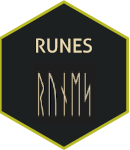
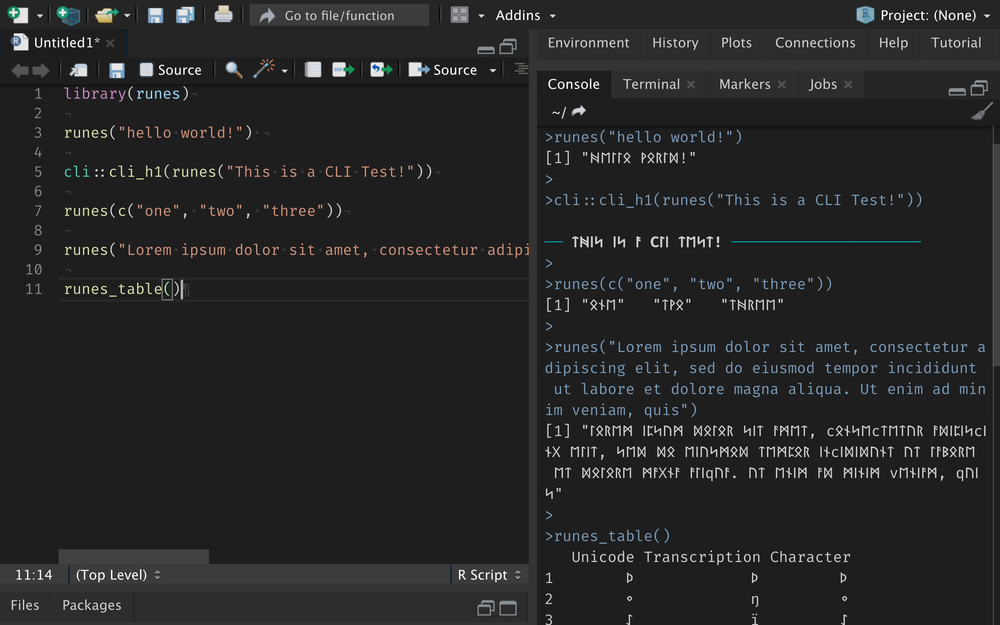

<h1 align="center">
runes - ᚱᚢᚾᛖᛋ 
</h1>

> Have you ever wanted Runes in your R Documents? Of course you did! so here's a package that gives you that functionality.


[](https://travis-ci.org/tallguyjenks/runes)
[](https://cran.r-project.org/web/checks/check_results_runes.html)
[](https://cran.r-project.org/package=runes)
[](https://cran.r-project.org/package=runes)
[](https://cran.r-project.org/package=runes)
[](https://cran.r-project.org/package=runes)

[](https://www.rdocumentation.org/packages/runes/versions/0.1.0)
[](https://doi.org/10.5281/zenodo.3868253)
[](https://orcid.org/0000-0002-9604-3069)

runes is a package to convert English _A-Z_ characters to Runes. There is a LaTeX package to do this with RMarkdown, but why not make it easier and more intuitive to get the runes you need when you need them? `runes("any string or vector here")` works as you'd expect.

I did not find a package in R that does this so i made it myself, so if you work with old Germanic runes for linguistic purposes or just really like runes like me, hopefully this will be a package you will get some use out of.

## What Does It Look Like?



## Dependencies

- <u>None:</u> Relies only on **base** functions.

## Installation

```r
# CRAN version:
install.packages("runes")

# OR for the development version:
remotes::install_github("tallguyjenks/runes")
```

## Usage

```r
library(runes)

runes("hello world!")

#> [1] "ᚻᛖᛚᛚᛟ ᚹᛟᚱᛚᛞ!"
```

If you want a complete translation table of unicode sequence --> English Transcription --> Rune Character you can call the `runes_table()` function that returns a data.frame of these items so you can use this for reference or input them into a document using the `DT`, `kable`, etc packages.

- `runes` can work with the pipe `%>%` to take a single string output as a piped input
- You can feed `runes` a string to format the output for any other function such as a console `cli::cli_h1(runes("This is a level 1 heading in runes"))`
- Let me know some of the uses YOU have made with it!

## How to Contribute

1. Read <a target="_blank" href="./CONTRIBUTING.md">CONTRIBUTING</a>
2. Clone repository and create a new branch.
3. Make changes and test
4. Submit Pull Request with comprehensive description of changes

## Acknowledgements

## Donations

This is free, open-source software. If you'd like to support the development of future projects, or say thanks for this one, you can donate to me through [paypal](https://www.paypal.me/tallguyjenks)

<!-- Buy me a coffee -->
<a href="https://www.buymeacoffee.com/tallguyjenks" target="_blank"></a>

## License

MIT
